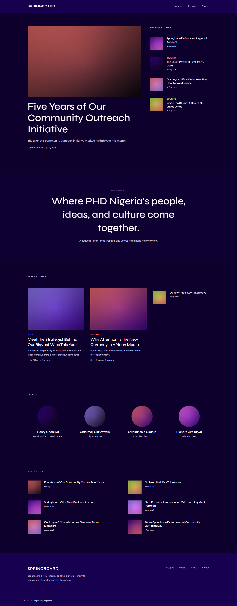

# Understanding Springboard

Welcome to Springboard — PHD Nigeria's editorial platform. This chapter is
for anyone using the Springboard Admin for the first time, whether you'll
be writing articles, managing photos, or just checking on what's been
published. Read this chapter before the others — it explains the ideas
every other chapter assumes you already have.

**You do not need to know how to code, or anything about databases or
websites, to use Springboard.** Everything in this guide is done by
clicking buttons and filling in forms, the same as any other website
you've used.

## The big picture

Springboard has two halves:

- **The public website** — what visitors see when they go to Springboard.
  Articles, company news, contributor profiles, a search box. Nobody needs
  to log in to read it.
- **The Admin** — a separate, password-protected area (starting at
  `/admin`) where editorial staff create and manage everything that
  appears on the public website.

You will spend all your time in the Admin. The public website is the
*result* of what you do there — you never edit the public pages directly.



## The pieces, and how they fit together

Springboard's Admin is organized into a small number of areas. Each one
has its own chapter later in this guide, but here's how they relate to
each other and to what a visitor actually sees:

| Area | What it does |
|---|---|
| **Navigation** | The links in the header menu visitors use to move around the site. |
| **Content** | The actual editorial material — articles and company news — that gets published to visitors. |
| **Sections** | Named groupings that organize one issue's worth of Content into blocks (e.g. "Insights", "Culture") on that issue's page. |
| **Categories** | A topic label attached to a piece of Content (e.g. "Insights", "People"), independent of which issue or section it's in. |
| **People (Contributors)** | The public profile behind a byline — who wrote or is featured in a piece of Content. |
| **Media** | The shared library of images that Content, People, and Site Settings all draw from. |
| **Site Settings** | Site-wide and homepage configuration — separate from any single piece of Content. |
| **Activity** | A read-only record of who changed what, and when. |
| **Users** | The accounts and roles that control who can do what in the Admin. |

A simple way to hold all of this in your head:

```
Navigation   → helps visitors move around the website
Sections     → organize one issue's worth of content into named blocks
Categories   → classify a piece of content by topic
Content      → the actual editorial material published to visitors
People       → identify the contributors/authors behind that content
Media        → stores the images everything else uses
Site Settings→ controls configurable site-wide/homepage elements
Activity     → records important changes made by administrators/editors
```

## The single most confusing thing: Navigation, Sections, and Categories are three *different* systems

New users almost always assume these three are the same thing, because in
Springboard's current setup, some of their names genuinely overlap. Right
now, PHD Nigeria's single issue ("Development Preview") happens to have
Sections named **Insights**, **Culture**, **People**, and **Company News**
— and the site's Categories happen to be named **Insights**, **Culture**,
and **People** too. Meanwhile, the header menu (Navigation) also has items
labelled **Insights** and **People**.

This is a coincidence of naming, not a real connection. Concretely:

- The **Navigation** item "Insights" in the header takes a visitor to the
  homepage's "More Stories" block. The **Navigation** item "People" takes
  them to the homepage's "People" block. Neither one has anything to do
  with any Section or Category — a Navigation item just points at a URL.
- The **Section** "Insights" is a block that appears on the "Development
  Preview" issue page specifically, showing whichever Content has been
  assigned to that Section. Renaming or deleting the Navigation item
  "Insights" does not touch this Section, or the content in it, at all.
- The **Category** "Insights" is a topic label that can be attached to any
  individual piece of Content, regardless of which issue or Section it's
  in. It's what makes the small colored word (e.g. "INSIGHTS") appear
  above an article's headline, and drives that article's "Related
  Stories" list. It has no display order, no page of its own, and no
  relationship to the Section of the same name.

Each of these three things is edited in a completely different place in
the Admin (Navigation, Sections, Categories respectively), and changing
one never changes another — even when they share a label. The chapters
that follow explain each one on its own; keep this distinction in mind
as you read them.

## Who can do what

Every Admin account has a **role**, and the role decides what you can do.
From least to most access:

- **Viewer** — a brand-new account, before anyone has assigned it a real
  role. A Viewer cannot get into the Admin at all.
- **Contributor** — can create and edit their own Content (up to
  submitting it for review), and upload images. Cannot publish content
  themselves, and cannot manage Categories, Sections, Publications,
  Contributors, or Navigation.
- **Editor** — everything a Contributor can do, plus publishing/
  scheduling/archiving any Content, and managing Categories, Sections,
  Publications, Contributors, and Navigation. Can view Activity.
- **Admin** — everything an Editor can do, plus managing Users and their
  roles, editing Site Settings, and deleting or promoting media.

The [User Management](10-user-management.md) chapter covers this in full
detail, including exactly what each role can and cannot do.

## How to read the rest of this guide

Every chapter from here on follows the same structure:

1. **What is [Feature]?** — plain-language explanation.
2. **Why is it important?** — what job it does for the website.
3. **What can I do here?** — the actual capabilities available to your role.
4. **How do I use it?** — numbered steps with real screenshots.
5. **What happens on the public website?** — how your change shows up to a visitor.
6. **Important things to know** — permissions, ordering, deletion, and other things that aren't obvious from the screen alone.

Continue to [Navigation](02-navigation.md) next.
