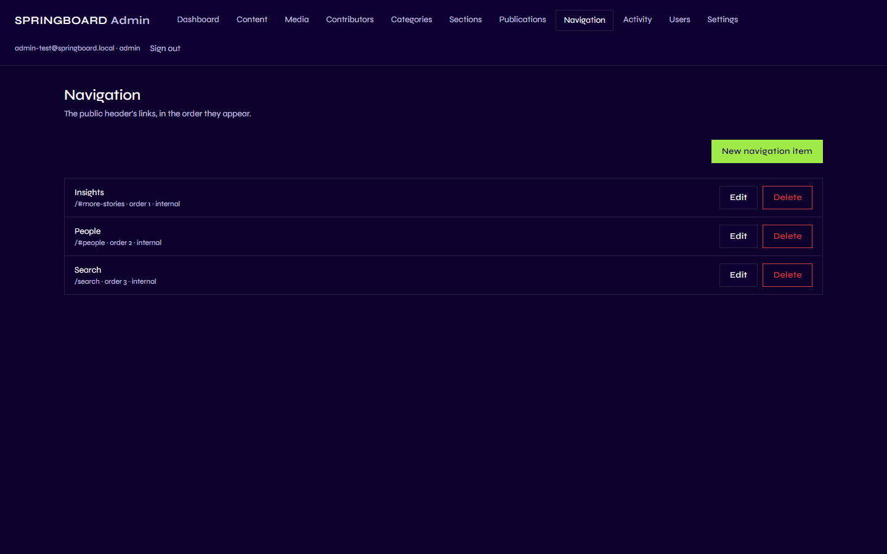
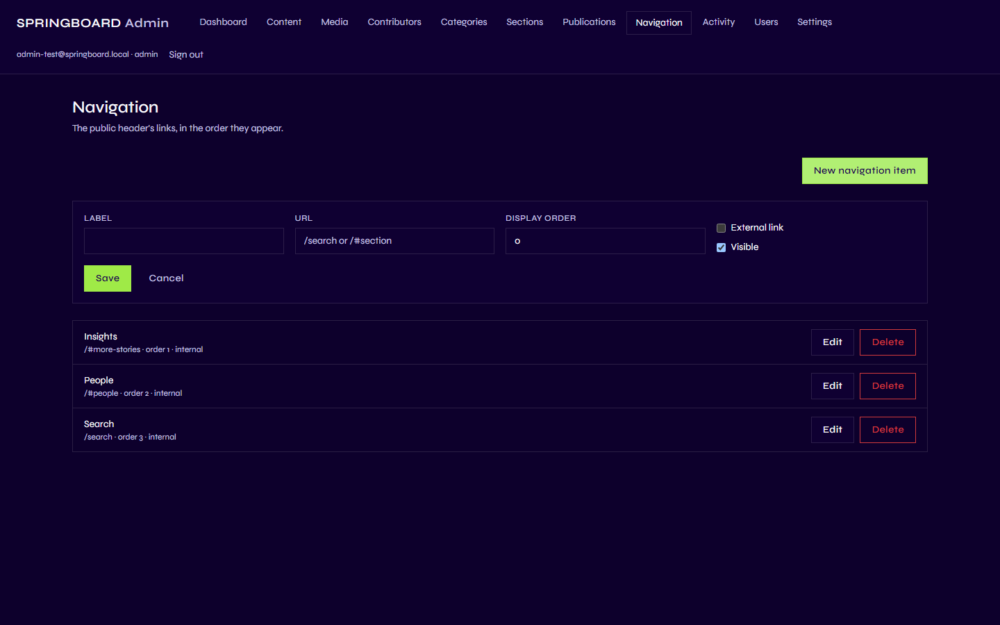
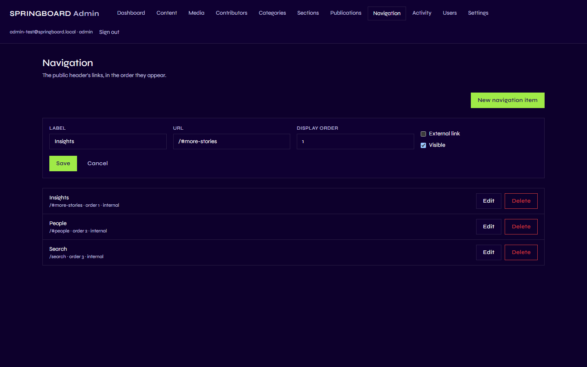
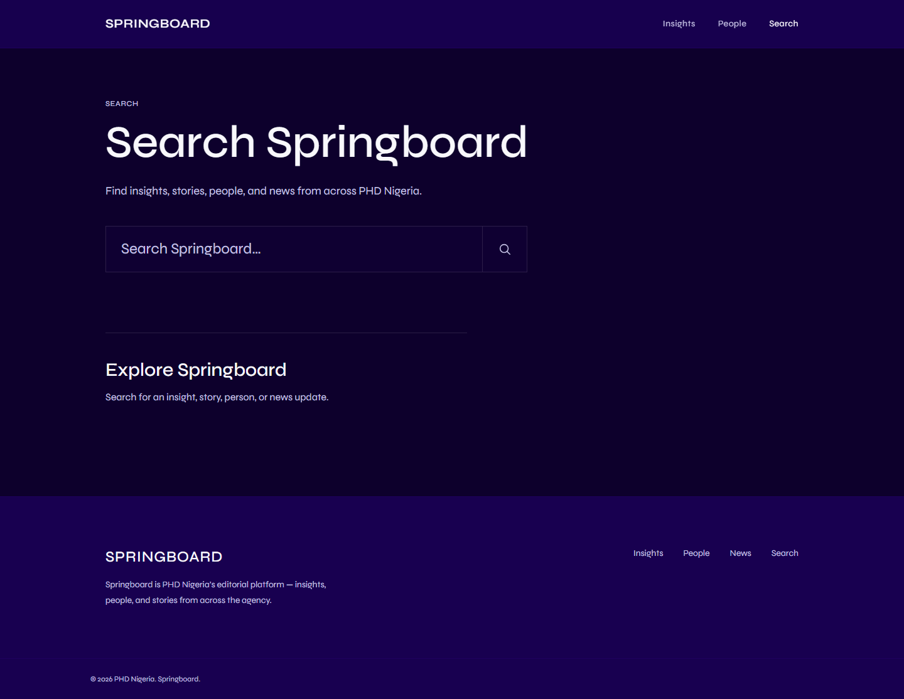

# Navigation

## 1. What is Navigation?

Navigation is the header menu at the top of every public Springboard
page — the small set of links (currently **Insights**, **People**, and
**Search**) sitting next to the SPRINGBOARD wordmark. Navigation controls
**only those links** — the words visitors click on and where each one
takes them. It has nothing to do with the articles, sections, or
categories those links might point at (see
[Understanding Springboard](01-understanding-springboard.md) if you
haven't read the note on this).

## 2. Why is it important?

The header menu is on every single page of the public site — it's the
one piece of navigation a visitor always has, no matter where they are.
If it's wrong, out of order, or points somewhere broken, every visitor
notices immediately. Because it's managed in the Admin rather than hard
into the code, an Editor or Admin can relabel a link, reorder the menu,
hide an item, or point "Search" somewhere new, without needing a
developer or a code deployment.

## 3. What can I do here?

| Capability | Contributor | Editor | Admin |
|---|:---:|:---:|:---:|
| View the Navigation list | ✅ (view only) | ✅ | ✅ |
| Add a navigation item | ❌ | ✅ | ✅ |
| Edit a navigation item | ❌ | ✅ | ✅ |
| Delete a navigation item | ❌ | ✅ | ✅ |
| Hide/show a navigation item | ❌ | ✅ | ✅ |
| Reorder navigation items | ❌ | ✅ | ✅ |

A Contributor doesn't even see **Navigation** as an option in the Admin's
top menu bar — it's hidden for that role. If you're an Editor or Admin,
you'll see it between **Publications** and **Activity**.

## 4. How do I use it?

Go to **Navigation** in the Admin menu.

Each row shows the item's label, its destination, its position in the
menu (`order`), and whether it's internal or external.

### Add a new navigation item

1. Click **New navigation item**.
2. Fill in:
   - **Label** — the word visitors see in the menu (e.g. "Careers").
   - **URL** — where it should go (see the field notes below).
   - **Display order** — a number; lower numbers appear first (see
     "Important things to know").
   - **External link** — tick this only if the URL leaves the Springboard
     site entirely (see below).
   - **Visible** — leave ticked to show it in the menu right away, or
     untick to save it hidden for now.
3. Click **Save**.

### Edit an existing item

1. Click **Edit** on the row you want to change.
2. The same form opens, pre-filled with that item's current values.
3. Change whatever you need, then click **Save**.

### Hide an item without deleting it

Open **Edit** and untick **Visible**, then **Save**. The item disappears
from the public menu immediately but stays in this list, so you can bring
it back later with one click.

### Reorder the menu

Open **Edit** on an item and change its **Display order** number. Items
are shown left-to-right in ascending order (1, 2, 3, …). To swap two
items, give them each other's number.

### Delete an item

Click **Delete** on a row. Springboard will tell you nothing else in the
system depends on this link (nothing does — see below) and offer
**Delete anyway**. This is permanent.

### Internal vs. external links, and "open in new tab"

- An **internal link** stays on the Springboard site — a page path like
  `/search`, or a same-page anchor like `/#people` (which jumps to a
  block already on the homepage). Leave **External link** unticked for
  these.
- An **external link** leaves the Springboard site entirely — e.g. a link
  to PHD Nigeria's main corporate site, or a partner's page. Tick
  **External link** for these, and enter the full address including
  `https://`.
- Only when **External link** is ticked does an **Open in new tab**
  option appear. Turn it on if the destination should open in a new
  browser tab rather than replacing the current one — the usual choice
  for a link that takes visitors away from Springboard, so they don't
  lose their place.

The current three items are internal, which is why "External link" and
"Open in new tab" don't show as ticked on any of them today:

- **Insights** → `/#more-stories` — jumps to the "More Stories" block on
  the homepage.
- **People** → `/#people` — jumps to the "People" block on the homepage.
- **Search** → `/search` — the site's search page.

## 5. What happens on the public website?

Whatever is in this list, in this order, with **Visible** ticked, is
exactly what every visitor sees in the header — on desktop and on
mobile. There's only one menu; Springboard doesn't maintain a separate
list for phones. A hidden item disappears from both instantly, and a
reorder is visible on the very next page load.

Editing Navigation **never** changes any article, section, or category —
it only changes which words appear in the menu and where they point.

## 6. Important things to know

- **Permissions.** Only Editors and Admins can add, edit, hide, reorder,
  or delete navigation items. A Contributor doesn't see the Navigation
  page in the menu at all.
- **Nothing else depends on a navigation item.** Deleting one is always
  safe from the system's point of view — no article, image, or
  contributor record references a navigation item, so there's nothing to
  "break" elsewhere. The only real risk is a dead link if you mistype a
  URL, or removing a way visitors expect to get somewhere.
- **A broken or wrong URL isn't caught automatically.** Springboard
  doesn't check that the address you type actually exists — double-check
  it before saving, especially for external links.
- **Visibility is immediate and has no in-between state.** There's no
  "draft" version of a navigation change — the moment you click Save, it
  goes live on the public menu.
- **This does not affect Sections or Categories.** Renaming or removing a
  Navigation item called "Insights" has zero effect on the Section or
  Category also called "Insights" — see
  [Understanding Springboard](01-understanding-springboard.md).

Next: [Sections](03-sections.md).
