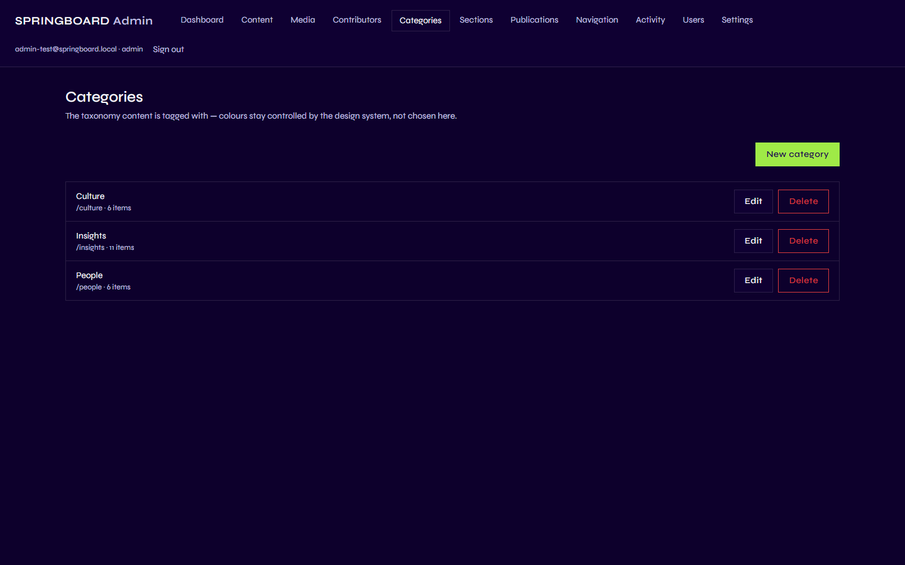
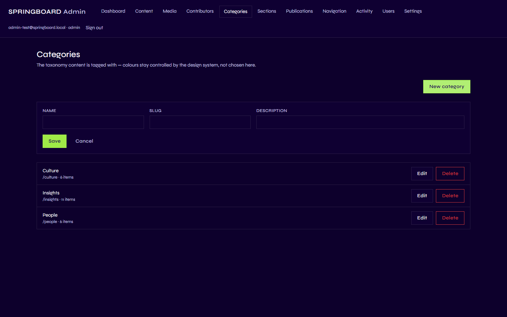
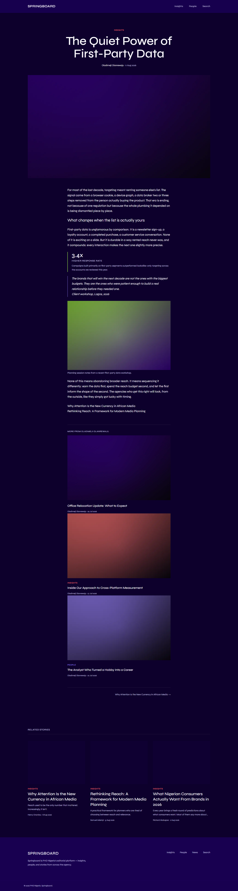

# Categories

## 1. What is a Category?

A Category is a topic label you can attach to a single piece of Content —
for example, "Insights", "Culture", or "People". Unlike a
[Section](03-sections.md), a Category isn't tied to any one issue: the
same Category can be used on content in any Publication, or on content
that isn't part of a Publication at all. It's a simple, site-wide list —
just a Name, a Slug, and an optional Description.

## 2. Category vs. Section vs. Navigation — the difference that matters most

This is worth repeating from [Understanding Springboard](01-understanding-springboard.md),
because Springboard's current Categories and Sections happen to share
names, which makes them easy to confuse:

- **Navigation** = how visitors move around the site (the header menu).
- **Sections** = how one issue's page is organized into blocks.
- **Categories** = how an individual piece of content is classified by
  topic, regardless of which issue or section it's in.

A single article always has a Section *and* a Category assigned
independently in its editor (plus, separately, which Publication it
belongs to) — they don't have to match, even though in today's content
they often do.

## 3. Why is it important?

Categories give every piece of content a topic label that travels with
it wherever it's shown — on its own page, and in "Related Stories" lists
elsewhere on the site. They're the simplest, lowest-effort way an editor
has to say "this piece is about X" without needing to decide which issue
or section it lives in.

## 4. What can I do here?

| Capability | Contributor | Editor | Admin |
|---|:---:|:---:|:---:|
| View the Categories list | ✅ (view only) | ✅ | ✅ |
| Create a category | ❌ | ✅ | ✅ |
| Edit a category | ❌ | ✅ | ✅ |
| Delete a category | ❌ | ✅ | ✅ |
| Assign a category to content | ✅ (on their own draft content) | ✅ (on any content) | ✅ |

## 5. How do I use it?

Go to **Categories** in the Admin menu.

The page's own description sums it up: *"The taxonomy content is tagged
with — colours stay controlled by the design system, not chosen here."*
In other words, each Category's on-page color is decided automatically
by Springboard, not something you pick.

### Create a category

1. Click **New category**.
2. Fill in:
   - **Name** — what appears as the label (e.g. "Culture").
   - **Slug** — a short, URL-safe identifier.
   - **Description** — optional; internal notes about what belongs in
     this category. It isn't shown to visitors.
3. Click **Save**.

### Edit or delete a category

Click **Edit** to change a category's details. Click **Delete** to
remove it — Springboard first tells you how many pieces of content
currently use it, since deleting a category doesn't delete that content;
it just removes the label from it.

### Assigning a category to content

This happens in the [Content](05-content.md) editor, not here — open any
article or company news item, and choose from the **Category** dropdown
alongside Author, Publication, and Section.

## 6. What happens on the public website?

When a piece of Content has a Category, two things change on its public
page:

- A small colored word appears above the headline (e.g. "INSIGHTS"),
  showing which Category it belongs to.
- A **"Related Stories"** block appears further down the page, listing
  up to three other published pieces that share the same Category.

Categories don't currently create a browsable listing page of their own
(there's no "all Insights stories" page a visitor can go to), and they
aren't used as a search filter — their only two effects are the label
and the Related Stories list above.

## 7. Important things to know

- **Permissions.** Only Editors and Admins can create, edit, or delete
  Categories. Contributors can pick an existing Category for their own
  content, but can't manage the list itself.
- **Deleting a category never deletes content.** Content that had it
  simply loses the label — nothing else changes, and nothing else on the
  site breaks.
- **Colors aren't configurable.** You choose the name; Springboard's
  design system decides the color automatically, consistently, based on
  the category itself.
- **A category is not the same record as a section named the same
  thing.** See the note at the top of this chapter, and
  [Understanding Springboard](01-understanding-springboard.md).

Next: [Content](05-content.md).
