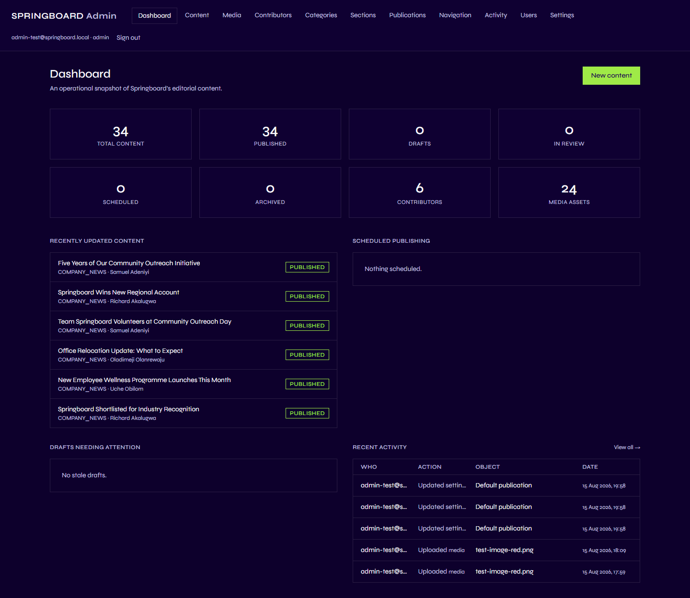
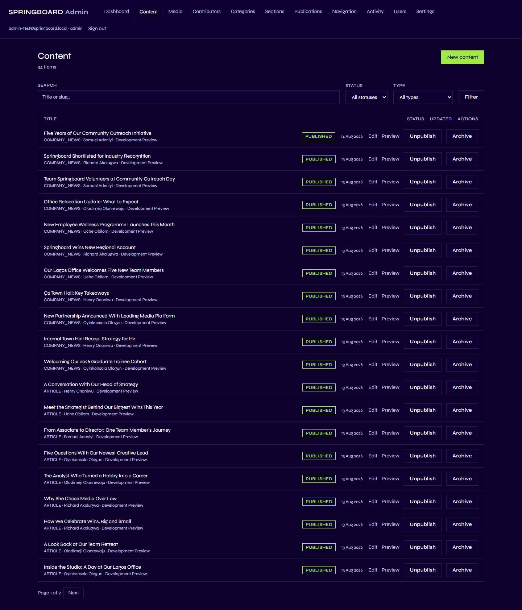
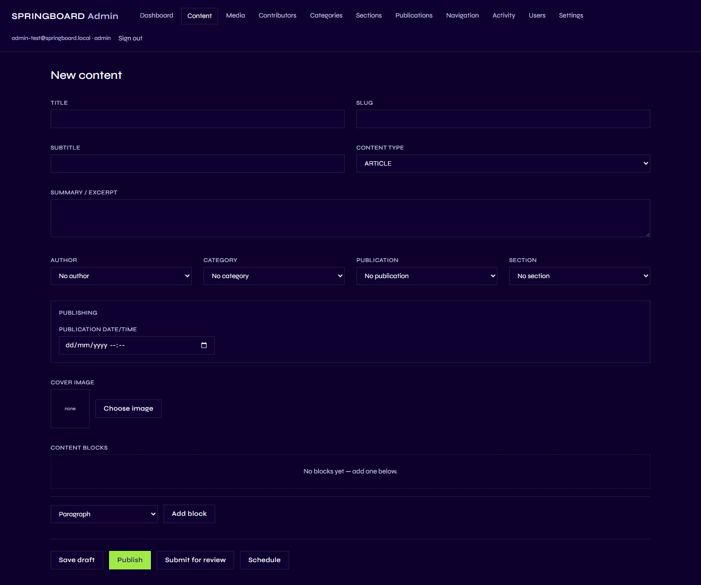
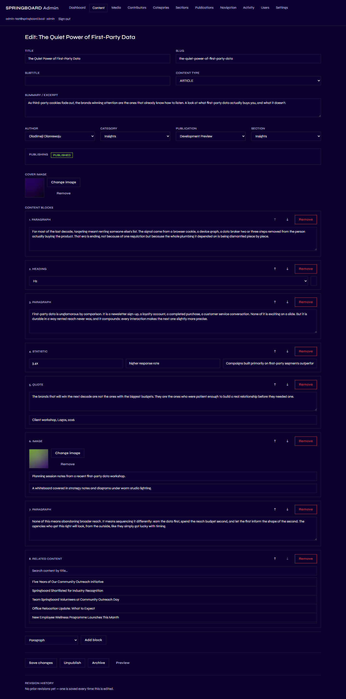

# Content

## 1. What is Content?

"Content" is Springboard's word for a single piece of editorial
material — an article, or a company news item. It has a title, a body
made up of blocks (paragraphs, images, quotes, and so on), and everything
needed to place it on the site: an author, a category, a publication, a
section, and a cover image.

Springboard is actually built to support several other kinds of content
too (events, staff spotlights, birthdays, health tips, galleries,
editor's notes), and you may see some of these already on the public
site from earlier work — but **only Articles and Company News can
currently be created or edited from the Admin's Content editor.** If you
need one of the other types, that isn't something the current Content
screen supports yet.

## 2. Why is it important?

Content is the actual substance of Springboard — it's what a visitor
comes to read. Everything else in this guide (Sections, Categories,
People, Media, Site Settings) exists to organize, classify, or support
Content. Getting the publishing workflow right — draft, review, publish,
schedule, archive — is what lets a team of several people work on
different pieces at once without anything going live by accident.

## 3. What can I do here?

| Capability | Contributor | Editor | Admin |
|---|:---:|:---:|:---:|
| Create new content | ✅ | ✅ | ✅ |
| Edit their own draft/in-review content | ✅ | ✅ | ✅ |
| Edit anyone's content | ❌ | ✅ | ✅ |
| Submit their own content for review | ✅ | — (not needed) | — (not needed) |
| Publish, schedule, unpublish, or archive | ❌ | ✅ | ✅ |
| Restore an archived item to draft | ❌ | ✅ | ✅ |
| Permanently delete content | ❌ | ❌ | ✅ |
| View revision history / restore a revision | ✅ (their own) | ✅ | ✅ |

A Contributor can write and edit their own work right up until it needs
to go live — at that point it has to pass to an Editor or Admin.

## 4. How do I use it?

The **Dashboard** (the first thing you see after signing in) gives a
quick count of content in each status:

Go to **Content** in the Admin menu to work with individual pieces.

Use **Search**, **Status**, and **Type** at the top to find something,
or click **New content** to start a new piece.

### Create a new article or company news item

1. Click **New content**.
2. Fill in the basics:
   - **Title** and **Slug** (the slug becomes part of the public web
     address — lowercase letters, numbers, and hyphens only).
   - **Subtitle** (optional) and **Content type** (Article or Company
     News).
   - **Summary / excerpt** — shown in card previews across the site.
3. Choose **Author**, **Category**, **Publication**, and **Section** from
   their dropdowns. (See [Sections](03-sections.md) and
   [Categories](04-categories.md) if you're unsure which is which —
   they're independent choices.)
4. Add a **Cover image** using **Choose image** — this opens the Media
   Library (see [Media](07-media.md)).
5. Build the body under **Content blocks**: pick a block type from the
   dropdown (Paragraph, Heading, Image, Gallery, Quote, Statistic, Video,
   Callout, or Related content), click **Add block**, and fill it in.
   Use the up/down arrows on a block to reorder it, or **Remove** to
   delete it.
6. Click **Save draft**.

### Preview

At any point after the first save, click **Preview** to see exactly how
the piece will look on the public site — without publishing anything.
Only signed-in Admin staff can open a preview; it's never visible to the
public.

### Submit for review (Contributors)

If you're a Contributor and want an Editor to check your work before it
goes live, click **Submit for review** instead of Publish. This is
optional — an Editor or Admin can publish directly without it.

### Publish

Click **Publish**. The piece goes live immediately at its public web
address.

### Schedule

Instead of Publish, set a **Publication date/time** and click
**Schedule**. The piece stays invisible to visitors until that exact
moment, then goes live automatically — nobody needs to be online for it
to happen. You can still edit a scheduled piece; **Save changes** keeps
it scheduled unless you deliberately click **Cancel schedule**.

### Unpublish

On a published piece, click **Unpublish** to pull it back to draft. It
stops being visible to the public immediately, and you can keep editing
and republish it whenever it's ready.

### Archive and Restore

**Archive** removes a piece from active editorial use — and from the
public site, if it was published — without deleting it. **Restore to
draft** (shown on an archived piece) brings it back to draft so you can
edit or republish it.

### Saving vs. Publishing — the difference

**Saving** (Save draft / Save changes) always just records your edits —
it never, by itself, changes whether the piece is visible to the public.
**Publishing** (or Scheduling) is the separate, deliberate action that
actually makes something visible. If you save changes to a piece that's
already published, it stays published and visitors see your edit
immediately — Springboard treats "already live" content as something
that must always stay reader-ready, so it won't let you save it into a
broken state (e.g. with no content blocks at all, or with no Publication
assigned).

### Revision history

Every save on an Article or Company News item keeps a snapshot. Scroll
to **Revision history** at the bottom of the editor to see every past
version; open one and click **Restore this version** to bring the
content's fields back to that state. Restoring never changes the piece's
current status (a restore never secretly unpublishes or republishes
anything), and it creates a new revision of its own — so you can always
go back further if you need to.

### Featured content

The homepage's lead story is either whichever piece was published most
recently, or a specific piece an Admin has chosen to feature instead —
see [Site Settings](08-site-settings.md).

## 5. What happens on the public website?

- **Published** content is visible immediately at its public web address,
  and appears in listings (the homepage, its issue page, its Section,
  search, "Related Stories", the author's page) according to its
  Category, Section, and Publication.
- **Scheduled** content stays completely invisible to the public until
  its publish time passes — then it appears automatically, with no
  further action from anyone.
- **Draft**, **In review**, and **Archived** content are never visible to
  the public, under any circumstances.

## 6. Important things to know

- **The five statuses, in plain English:**
  - **Draft** — being worked on, not visible to anyone but staff.
  - **In review** — a Contributor's way of flagging "please check this"
    to an Editor; still invisible to the public.
  - **Scheduled** — locked in to go live automatically at a future date
    and time.
  - **Published** — live on the public site right now.
  - **Archived** — retired from active use; pulled from the public site
    if it had been published, but never deleted.
- **Only Editors and Admins can move something into Scheduled or
  Published.** A Contributor's own attempt to do so (if they somehow
  tried) would simply be refused — the same underlying rule that
  controls the buttons you see also controls what the system will
  actually accept.
- **A Contributor can only edit their own content, and only while it's
  Draft or In review.** Once an Editor publishes or schedules it, it's
  out of the original Contributor's hands to edit directly.
- **Permanent deletion is Admin-only.** Editors archive instead — that's
  the only way to "remove" something from your own account if you're not
  an Admin.
- **Slugs must be unique within a Publication.** Springboard will tell
  you if the one you chose is already taken there.
- **Only two content types are creatable here today: Article and Company
  News.** Other content types you might see on the site (events, staff
  spotlights, etc.) were not created through this screen.

Next: [People / Contributors](06-people-contributors.md).
