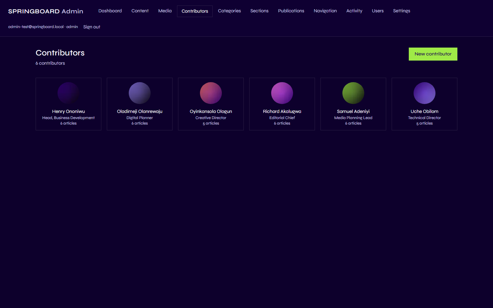
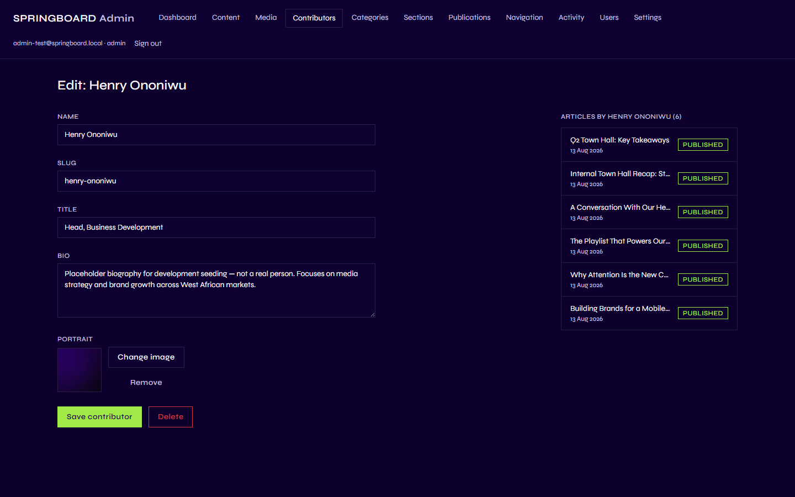
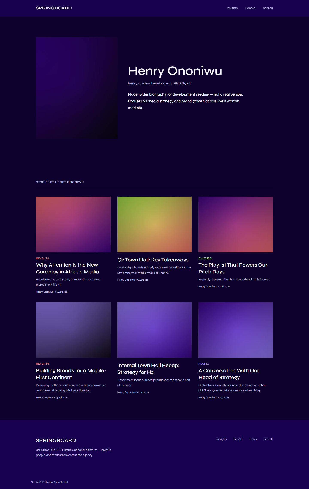

# People / Contributors

## 1. What is a Contributor record?

In the Admin's menu this area is called **Contributors** — it's
Springboard's list of the people who write or are featured in Content: a
name, a job title, a short bio, and a portrait photo. Each one gets its
own public page.

**Important naming note:** this is *not* the same thing as the
"Contributor" **role** a person's Admin account can have (see
[User Management](10-user-management.md)). A Contributor *record* here is
a public profile — like a byline — with no login, no password, and no
role of its own. Someone with the Contributor *role* logged into the
Admin is a completely separate concept from a Contributor *record* shown
publicly, even though the same word is used for both. A staff member
could have a Contributor-role Admin account and also have their own
Contributor profile written up by someone else, or neither, or both —
they're unrelated.

## 2. Why is it important?

Every article or company news piece can credit an author, and that
author's name, title, and photo are what actually appear under the
headline and on their own page. Keeping this as its own reusable list —
rather than typing a name into every article — means updating someone's
title or photo once updates it everywhere they're credited.

## 3. What can I do here?

| Capability | Contributor (role) | Editor | Admin |
|---|:---:|:---:|:---:|
| View the Contributors list | ✅ | ✅ | ✅ |
| Create a contributor record | ❌ | ✅ | ✅ |
| Edit a contributor record | ❌ | ✅ | ✅ |
| Delete a contributor record | ❌ | ✅ | ✅ |
| Assign a contributor as an author on content | ✅ (on their own draft content) | ✅ | ✅ |

Yes — a person signed in with the Contributor *role* can see this list
and open a record, but cannot save any change to it. Only Editors and
Admins can actually create, edit, or delete Contributor records.

## 4. How do I use it?

Go to **Contributors** in the Admin menu.

### Create a contributor

1. Click **New contributor**.
2. Fill in:
   - **Name** and **Slug** — required. The slug becomes part of that
     person's public web address.
   - **Title** and **Bio** — optional, but recommended; these show on
     their public page.
3. Add a **Portrait** using **Change image** — this opens the Media
   Library (see [Media](07-media.md)).
4. Click **Save contributor**.

### Edit a contributor

Open them from the Contributors list. The same fields appear, alongside
a list of every piece of Content they're credited on.

### Add or change a portrait

Same flow as any other image in Springboard: click **Change image**,
either upload a new one or pick an existing one from the Media Library,
then make sure it's **promoted to public** (see [Media](07-media.md)) so
it's actually visible on their public page rather than showing as blank.

## 5. What happens on the public website?

A Contributor's Name, Title, and Bio appear:

- Under the headline of any piece of Content they're credited as the
  author of.
- On their own public page — its web address ends in their slug (e.g.
  `/contributors/henry-ononiwu`) — alongside every published piece
  they've written.
- In the homepage's "People" block, if they're one of the featured
  picks or among the site's contributors shown there (see
  [Site Settings](08-site-settings.md) for how that selection works).

## 6. Important things to know

- **Permissions.** Only Editors and Admins can create, edit, or delete
  Contributor records — this is true even for someone whose Admin
  account has the Contributor role, which is the naming collision
  explained at the top of this chapter.
- **Deleting a contributor doesn't delete their content.** Any piece of
  Content that credited them simply loses that author credit — it stays
  on the site.
- **A portrait must be public to actually show.** An unpromoted (private)
  image won't appear on the public page — see [Media](07-media.md).
- **Every contributor is always visible.** There's no hide/show toggle
  here, unlike Navigation items — a contributor record either exists (and
  is visible) or is deleted.

Next: [Media](07-media.md).
