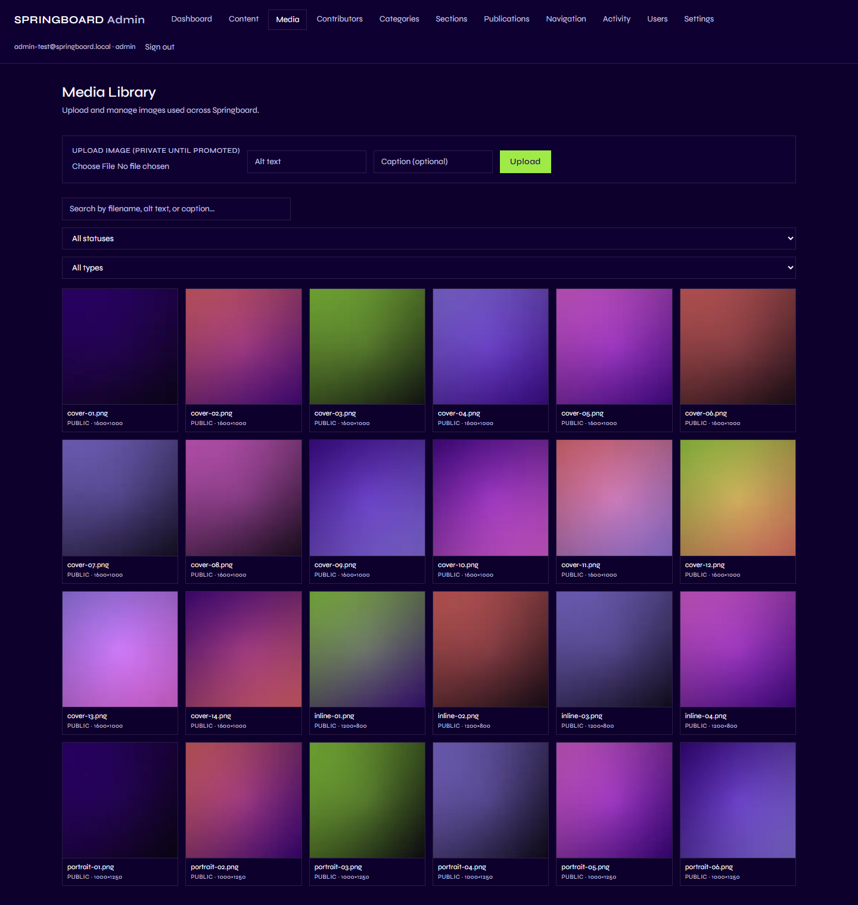

# Media

## 1. What is the Media area?

The Media Library is Springboard's shared collection of images — cover
photos, portraits, inline article images, and so on. Instead of
uploading the same picture separately for every article that needs it,
you upload it once here, and then *select* it wherever it's needed.

## 2. Why is it important?

Using one shared library instead of re-uploading everywhere means:

- Updating or replacing an image once updates every place it's used.
- Nothing gets uploaded twice by accident.
- An Admin can review and approve an image (see "Promote", below) before
  it can ever appear to the public — nothing becomes visible just because
  someone uploaded it.

## 3. What can I do here?

| Capability | Contributor | Editor | Admin |
|---|:---:|:---:|:---:|
| Upload an image | ✅ | ✅ | ✅ |
| Select an existing image (as a cover, portrait, etc.) | ✅ | ✅ | ✅ |
| Edit alt text / caption | ✅ | ✅ | ✅ |
| Replace the underlying file | ✅ | ✅ | ✅ |
| Promote a private image to public | ❌ | ❌ | ✅ |
| Delete an image | ❌ | ❌ | ✅ |

## 4. How do I use it?

Go to **Media** in the Admin menu.

### Upload an image

1. Under **Upload image**, click **Choose File** and pick a JPEG, PNG, or
   WebP file (25MB maximum — other formats aren't accepted).
2. Optionally add **Alt text** (a short description for accessibility and
   screen readers) and a **Caption**.
3. Click **Upload**.

New uploads are always **private** at first — nothing becomes publicly
visible just from uploading it.

### Select an image while editing something else

Wherever you see **Choose image** or **Change image** — a content
piece's cover, a Gallery block, a contributor's portrait, a site asset —
it opens this same Media Library. You can search existing uploads or
upload a new one right there, without leaving what you were working on.

### Promote (make an image public) — Admin only

A private image must be **promoted** before it can appear anywhere on
the live public site. Open the image in the Media Library and click
**Promote to Public**. If you're not an Admin, ask one to promote it once
it's ready to go live.

### Replace

Open an image and use **Replace** to swap the underlying file while
keeping everything that already uses it pointed at the same image — you
don't need to re-select it in every article, contributor profile, or
setting that uses it. Replacing never changes whether it's public or
private; that stays as it was.

### Delete — Admin only

Before deleting, the Media Library shows exactly what currently uses the
image (a cover, a contributor portrait, a publication cover, an inline
image inside an article) so nothing on the live site breaks by accident.

## 5. What happens on the public website?

An image only ever appears to a visitor if two things are both true: it
has been **promoted to public**, *and* something (an article's cover, a
contributor's portrait, a site asset, etc.) is actually pointing at it.
A private image that's referenced somewhere doesn't show as broken — the
page simply falls back to its normal placeholder treatment instead,
exactly as if no image had been chosen at all.

## 6. Important things to know

- **Format and size limits.** Only JPEG, PNG, and WebP are accepted, up
  to 25MB per file.
- **Uploads always start private.** This is deliberate — it gives an
  Admin a checkpoint before anything reaches the public site.
- **Promoting and deleting are Admin-only**, everything else (uploading,
  selecting, editing alt text/caption, replacing) is open to every role.
- **Deletion checks usage first.** You'll always see what's currently
  using an image before you're allowed to delete it, with a chance to
  cancel.
- **Replacing keeps the same reference.** Every place that already picked
  an image keeps working after a replace — nothing needs to be re-selected.

Next: [Site Settings](08-site-settings.md).
