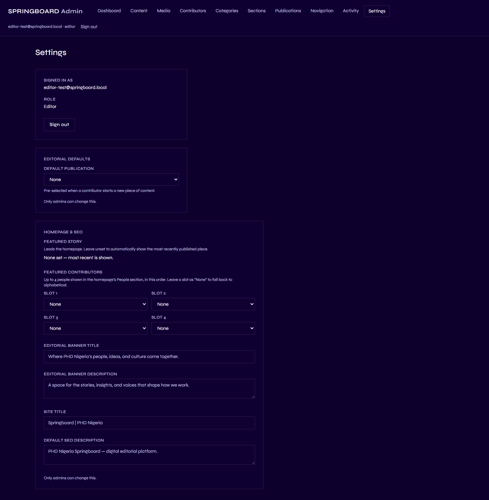
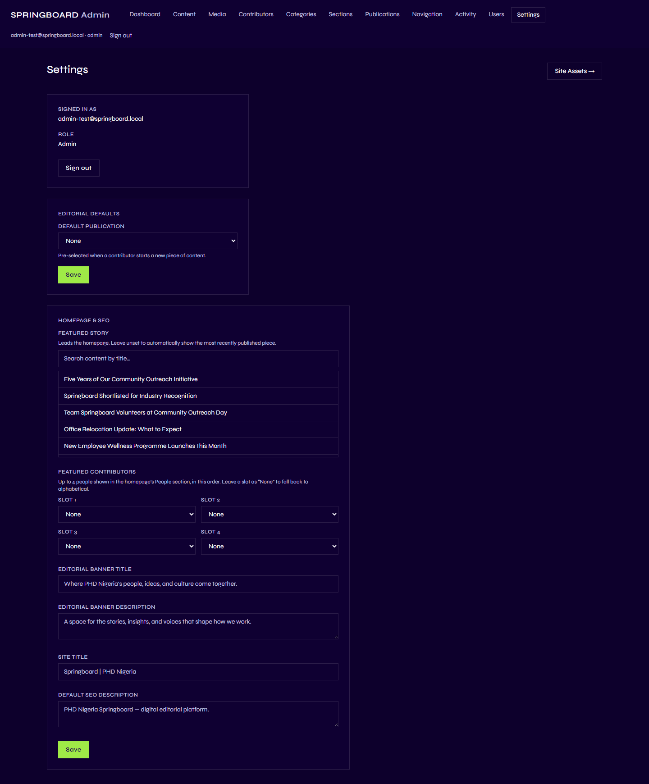
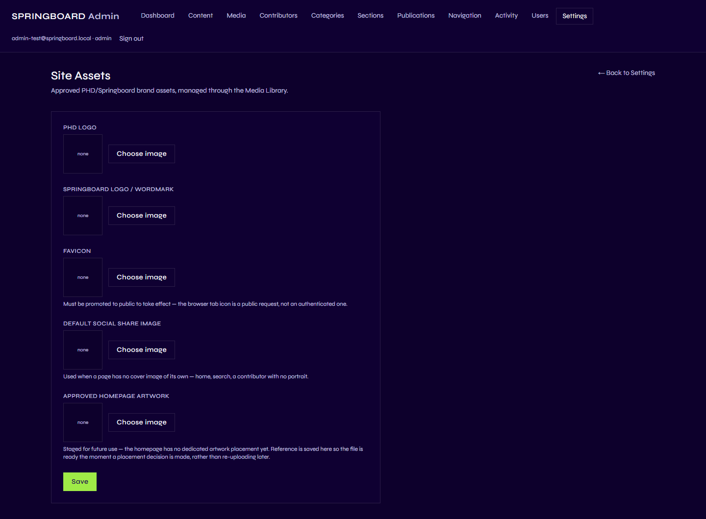

# Site Settings / Homepage

## 1. What is Site Settings?

Site Settings is a small set of site-wide switches and picks that aren't
tied to any single piece of Content — things like which story leads the
homepage, or what the site's default title is. It's split into two
screens: **Settings** (editorial defaults and homepage/SEO configuration)
and **Site Assets** (approved brand images), reached via the **Site
Assets →** link at the top of Settings.

## 2. Site-wide settings vs. editorial content — the distinction

Everything in this chapter is a **configuration switch**, not a piece of
content: it doesn't have its own headline, body, author, or publish
date, and it never appears in the Content list. It quietly changes *how*
other pages behave — which story the homepage leads with, what shows in
a browser tab, and so on — rather than being a page of its own.

## 3. What can I do here?

| Capability | Contributor | Editor | Admin |
|---|:---:|:---:|:---:|
| View Settings | ✅ (read only) | ✅ (read only) | ✅ |
| Change Settings | ❌ | ❌ | ✅ |
| View/change Site Assets | ❌ (page not shown) | ❌ (page not shown) | ✅ |

Contributors and Editors can open **Settings** and see the current
values, but every field is disabled for them — a note under each locked
section reads *"Only admins can change this."* **Site Assets** isn't
shown to them as an option at all.

## 4. How do I use it? (Admin)

Go to **Settings** in the Admin menu.

### Editorial Defaults

- **Default publication** — pre-selected automatically on the Publication
  field whenever a Contributor starts a new piece of content, saving them
  a click. Leave it as **None** if you don't want a default.

Change it and click the **Save** button directly beneath it.

### Homepage & SEO

- **Featured story** — search for and pick a specific piece of content to
  lead the homepage. Leave it unset and Springboard automatically shows
  whichever piece was published most recently instead.
- **Featured contributors** — up to four people (Slot 1–4) to show in the
  homepage's "People" block, in the order you set them. Leave a slot as
  **None** and Springboard falls back to showing contributors
  alphabetically instead.
- **Editorial banner title** and **description** — the large pull-quote
  text block on the homepage, between the featured story and "More
  Stories".
- **Site title** and **Default SEO description** — feed the browser tab
  title and the default description search engines and social shares use
  for pages that don't set their own.

Click **Save** at the bottom of this section when you're done. Leaving
any of these fields blank isn't an error — Springboard falls back to its
normal automatic behavior for whichever ones you skip.

### Site Assets

Click **Site Assets →** at the top of the Settings page.

There are five asset slots, each filled the same way: click **Choose
image** to open the Media Library, pick or upload an image, and make
sure it's promoted to public (see [Media](07-media.md)) — the page itself
warns you where this matters. Click **Save** once you're done.

## 5. What happens on the public website?

This is the one place in this guide where it matters to be precise,
because **not every asset slot is wired up to a visible spot on the site
yet.** Verified directly from what each field's own helper text says in
the Admin:

| Setting | Effect on the public site |
|---|---|
| Default publication | None directly — it only pre-fills a form field in the Admin. |
| Featured story | Replaces the homepage's normal "most recently published" lead story. |
| Featured contributors | Replaces the homepage People block's normal alphabetical list. |
| Editorial banner title/description | Shown as the homepage's large pull-quote block. |
| Site title / Default SEO description | Used in the browser tab and as the fallback for search engine and social-share previews, wherever a page doesn't set its own. |
| **Favicon** | Shown as the browser tab icon — *"must be promoted to public to take effect."* |
| **Default social share image** | Shown when a shared page has no cover image of its own — *"used when a page has no cover image of its own — home, search, a contributor with no portrait."* |
| **PHD logo** | Saved, but **not currently shown anywhere on the public site.** |
| **Springboard logo/wordmark** | Saved, but **not currently shown anywhere on the public site** — the header currently shows "SPRINGBOARD" as plain text, not this image. |
| **Approved homepage artwork** | Saved, but **not currently shown anywhere** — the Admin's own description says it's *"staged for future use — the homepage has no dedicated artwork placement yet."* |

In short: of the five Site Assets, only the **Favicon** and **Default
social share image** currently appear anywhere a visitor can see. The
other three are ready and waiting for a future update, not currently
live.

## 6. Important things to know

- **Only Admins can change anything here.** Editors and Contributors can
  see current values, but every field is locked for them.
- **Blank is a valid, safe choice.** Every setting has a sensible
  automatic fallback — you're never required to fill one in.
- **Changes take effect immediately**, the same as any other Admin save —
  there's no separate publish step for settings.
- **An unpromoted image won't show, even if selected.** Any asset picked
  here still needs to be public (see [Media](07-media.md)) to actually
  render for visitors.

Next: [Activity](09-activity.md).
