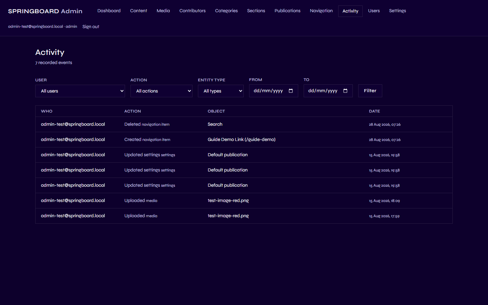

# Activity

## 1. What is the Activity page?

Activity is a running, read-only record — an audit trail — of the
significant things editorial staff and admins have done in Springboard:
content published or unpublished, a navigation item added, a user
account's role changed, media uploaded, and so on. You can't edit or
delete anything here; it's a history, not a working area.

## 2. Why is it important?

When several people share access to the same site, it's useful to be
able to answer "who changed this, and when?" without having to ask
around. Activity gives editorial and admin staff exactly that — a
transparent, chronological log they can search and filter.

## 3. What can I see here?

| Capability | Contributor | Editor | Admin |
|---|:---:|:---:|:---:|
| View Activity | ❌ (page not shown) | ✅ (most entries) | ✅ (everything) |

Contributors don't see **Activity** in the Admin menu at all. Editors see
everything except account/role changes and Settings changes — those two
filter options are hidden for them, and the underlying records are
hidden too, not just the filter. Admins see all of it.

## 4. How do I use it?

Go to **Activity** in the Admin menu.

Each row shows:

- **Who** — the email address of the person who made the change.
- **Action** — what they did (Created, Updated, Published, Deleted, and
  so on).
- **Object** — what it was done to, described in plain language (an
  article's title, a navigation item's label and address, a media
  filename, and so on).
- **Date** — exactly when it happened.

### Filtering

Use the dropdowns and date fields at the top — **User**, **Action**,
**Entity type**, **From**/**To** — then click **Filter**. Any combination
can be used together, or leave them all on "All" to see everything you
have access to.

### Identifying who changed something

Every entry names the specific signed-in account that made the change —
there's no anonymous or system-generated entry for anything a person did
through the Admin.

### Navigation changes

Creating, editing, or deleting a [Navigation](02-navigation.md) item logs
an entry with the item's **label and destination**, so you can see
exactly which link changed and where it pointed, even after it's been
deleted. In the screenshot above, "Created navigation item — Guide Demo
Link (/guide-demo)" and "Deleted navigation item — Search" are both real
examples of this.

### Content changes

Creating, editing, publishing, unpublishing, scheduling, archiving, or
restoring a piece of [Content](05-content.md) each get their own
distinct entry, named by that piece's title.

### Other activity types

Media uploads, promotions, replacements, and deletions; contributor
records being created or edited; category, section, and publication
changes; and (Admin-only visibility) user role changes and settings
updates all appear here too, in the same format.

## 5. What happens on the public website?

Nothing — Activity is entirely an internal Admin tool. It has no public
page and no effect on anything visitors see.

## 6. Important things to know

- **This is a record, not an editing tool.** You cannot undo anything
  from this page — to reverse a change, go back to the relevant area
  (Content, Navigation, etc.) and make the opposite change there. (For
  Content specifically, see [Content](05-content.md)'s note on Revision
  history, which *can* restore an earlier version.)
- **Contributors have no access to this page at all.**
- **Editors see less than Admins.** Role/user changes and Settings
  updates are visible only to Admins — both as filter options and as
  actual rows, so an Editor genuinely cannot see that history exists, not
  just that the filter is missing.

Next: [User Management](10-user-management.md).
