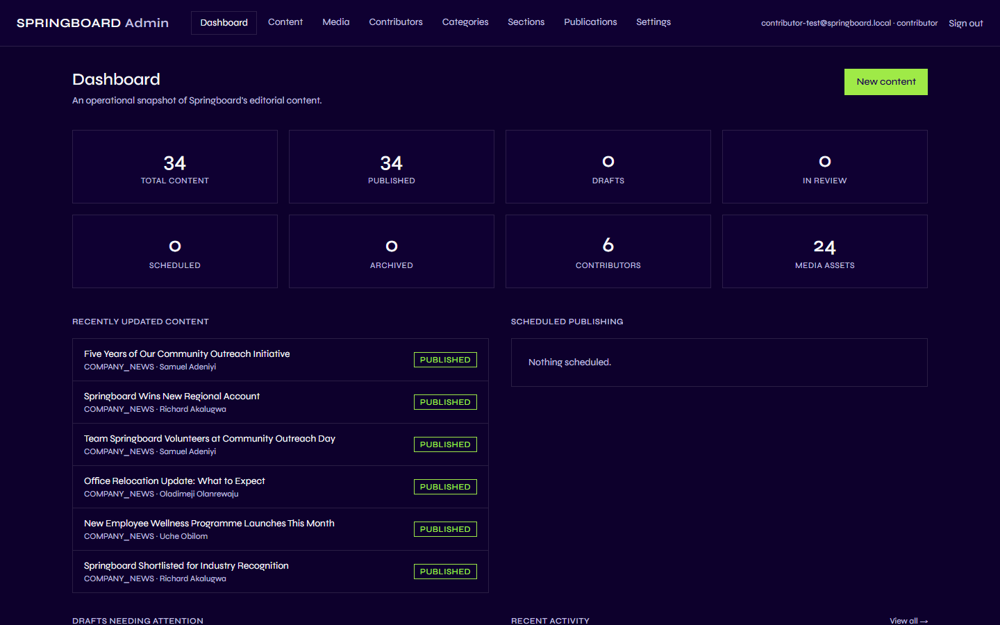
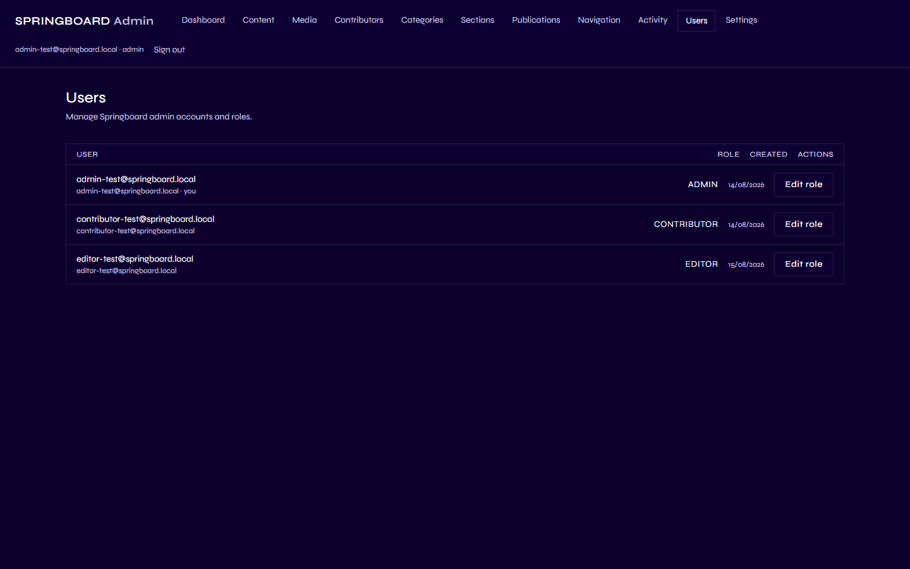

# User Management

## 1. What is a user, and what is a role?

A "user" is one person's Admin account — an email address and password
that lets them sign in at `/admin/login`. Every user has exactly one
**role**, and that role is what actually decides what they're allowed to
do inside Springboard. There are four roles, from least to most access:
**Viewer**, **Contributor**, **Editor**, and **Admin**.

**Getting an account is not self-service, and Admins cannot create new
accounts either.** There's no sign-up form anywhere in Springboard, and
no "create account" or "invite user" button in the Admin — not even for
Admins. A brand-new account can only be created directly by PHD
Nigeria's technical team, working outside the Admin. If you need access
and don't have an account yet, ask the technical team to create one for
you. Once it exists, any Admin can then assign it a working role from
**Users** (see below) — but creating the account itself is a step only
the technical team can do.

## 2. Why is it important?

Roles are what keep Springboard safe to share across a whole editorial
team. They let a Contributor draft freely without any risk of publishing
by accident, let an Editor run day-to-day publishing without needing
Admin-level access to site configuration, and keep account/role
management and site-wide settings limited to a small number of trusted
Admins.

## 3. What each role can and cannot do

This table is drawn directly from Springboard's actual permission rules,
not guessed from the role names:

| | Viewer | Contributor | Editor | Admin |
|---|:---:|:---:|:---:|:---:|
| **Sign into the Admin at all** | ❌ | ✅ | ✅ | ✅ |
| Create/edit their own draft content | — | ✅ | ✅ | ✅ |
| Submit content for review | — | ✅ | — | — |
| Publish, schedule, unpublish, archive any content | — | ❌ | ✅ | ✅ |
| Permanently delete content | — | ❌ | ❌ | ✅ |
| Upload media / select existing media | — | ✅ | ✅ | ✅ |
| Promote media to public / delete media | — | ❌ | ❌ | ✅ |
| Manage Categories, Sections, Publications | — | ❌ | ✅ | ✅ |
| Manage Contributor (People) records | — | ❌ | ✅ | ✅ |
| Manage Navigation | — | ❌ | ✅ | ✅ |
| View Activity | — | ❌ | ✅ (partial) | ✅ (full) |
| View Settings | — | ✅ (read only) | ✅ (read only) | ✅ |
| Change Settings / Site Assets | — | ❌ | ❌ | ✅ |
| Manage Users and roles | — | ❌ | ❌ | ✅ |

**A brand-new account is always a Viewer, and a Viewer cannot get into
the Admin at all** — visiting `/admin` sends them straight back to the
sign-in page, exactly as if they weren't logged in, even though their
account genuinely exists. Viewer is effectively a "not yet given a real
role" placeholder, not a working role with its own set of permissions.
Someone needs to be promoted out of it by an Admin before they can do
anything in the Admin.

Roles also change what shows up in the Admin's own menu bar — a
Contributor's menu, for example, has no Navigation, Activity, or Users
option at all, because none of those apply to what they're allowed to
do:

## 4. How do I use it? (Admin)

Go to **Users** in the Admin menu. This option is only shown to Admins.

### Change someone's role

1. Click **Edit role** on their row.
2. Choose the new role from the dropdown that appears (Viewer,
   Contributor, Editor, or Admin).
3. The change saves as soon as you pick a value — there's no separate
   confirm step.

## 5. What happens on the public website?

Nothing directly — roles and users are an entirely internal Admin
concept. What *does* change publicly is indirect: promoting someone to
Editor, for example, means they can now publish content that will appear
on the public site — but the role change itself has no public page or
visible effect of its own.

## 6. Important things to know

- **You can't remove the last Admin.** If you try to change the only
  remaining Admin to any other role, Springboard refuses and tells you to
  promote someone else first. This guarantees there's always at least one
  person who can manage users and settings.
- **Every role change is logged.** It shows up in
  [Activity](09-activity.md) (visible to Admins) as a role change, naming
  who did it, whose role changed, and the before/after values.
- **The "Contributor" role and Contributor (People) records are
  different things.** Someone's account can have the Contributor role
  without them having a public Contributor profile, and vice versa — see
  [People / Contributors](06-people-contributors.md) for the full
  explanation.
- **Nothing here is guessed from role names.** Every permission listed in
  the table above reflects how Springboard actually behaves, verified
  directly, not assumed from what a role is called.

---

This completes the Springboard Admin & Editorial User Guide. If
something in the Admin doesn't do what this guide describes, or a button
doesn't seem to work for your role, that's very likely the permission
system doing exactly what it's supposed to — not a mistake on your part.
